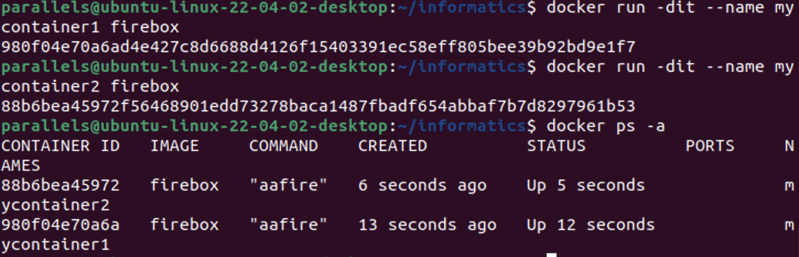
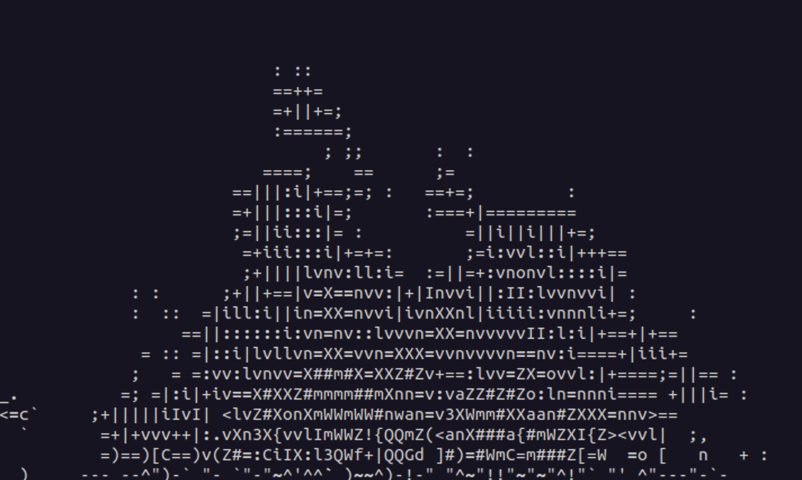
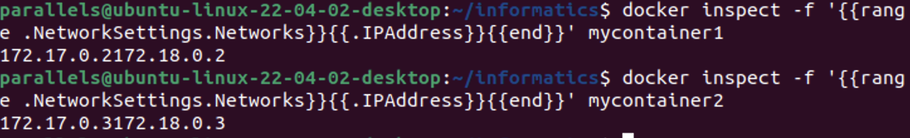
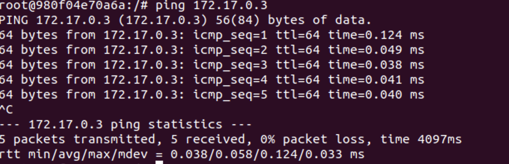

# Отчет по лабораторной работе 4: Использование Docker и настройка сети между контейнерами

## Описание лабораторной работы

Цель лабораторной работы — установить и использовать Docker для запуска консольного приложения `aafire`, а также организовать сетевое взаимодействие между двумя контейнерами. В ходе работы создаются собственные образы, запускаются контейнеры, создается пользовательская сеть и проверяется возможность взаимодействия между контейнерами с помощью утилиты `ping`.

## Используемые инструменты

- Docker
- Терминал
- Приложения `aafire` и `iputils-ping`
- Пользовательская Docker-сеть `myNetwork`

---

## Шаг 1: Создание Dockerfile

Создан файл `Dockerfile` со следующим содержимым:

```dockerfile
FROM ubuntu:latest

RUN apt-get update && \
    apt-get install -y aafire iputils-ping && \
    apt-get clean

CMD ["aafire"]
```

**Объяснение:**
- `FROM ubuntu:latest` — используется последняя версия образа Ubuntu.
- `apt-get install -y aafire iputils-ping` — устанавливаются нужные утилиты: `aafire` (графический огонь в ASCII) и `ping`.
- `CMD ["aafire"]` — при запуске контейнера по умолчанию запускается `aafire`.

---

## Шаг 2: Сборка образа Docker

```bash
docker build -t aafire-img .
```

**Объяснение команды:**
- `build` — создание образа на основе Dockerfile.
- `-t aafire-img` — тэг (имя) создаваемого образа.

---

## Шаг 3: Запуск контейнеров

Запущены два контейнера на основе образа `aafire-img`:

```bash
docker run -dit --name mycontainer1 aafire-img
docker run -dit --name mycontainer2 aafire-img
```

**Объяснение:**
- `-d` — detached mode (в фоне);
- `-i` — интерактивный режим;
- `-t` — поддержка псевдотерминала;
- `--name` — задает имя контейнера для удобства управления.

**Скриншот из терминала:**  


---

## Шаг 4: Подключение к работающему контейнеру

```bash
docker attach mycontainer1
```

**Объяснение:**
- Команда `docker attach` подключает терминал к работающему контейнеру, и позволяет видеть его стандартный вывод.
- В данном случае на экране появится "огонь" в ASCII-графике от утилиты `aafire`.
- Чтобы **выйти из контейнера, не останавливая его**, нужно использовать сочетание клавиш: `Ctrl + P`, затем `Ctrl + Q`.
- Это "отцепит" терминал от контейнера, но сам контейнер продолжит работу в фоне.

**Скриншот из терминала:**  


---

## Шаг 5: Создание пользовательской сети

```bash
docker network create myNetwork
```

**Объяснение:**
- Создается bridge-сеть с именем `myNetwork`, которая позволяет контейнерам "видеть" друг друга по именам и IP.

---

## Шаг 6: Подключение контейнеров к сети

```bash
docker network connect myNetwork mycontainer1
docker network connect myNetwork mycontainer2
```

**Объяснение:**
- Команды добавляют контейнеры `mycontainer1` и `mycontainer2` в пользовательскую сеть `myNetwork`.

---

## Шаг 7: Получение IP-адресов контейнеров и доступ внутрь

Для получения IP-адресов контейнеров после подключения к сети выполнены команды:

```bash
docker inspect -f '{{range .NetworkSettings.Networks}}{{.IPAddress}}{{end}}' mycontainer1
```

**Результат:**
```
172.17.0.2172.18.0.2
```

```bash
docker inspect -f '{{range .NetworkSettings.Networks}}{{.IPAddress}}{{end}}' mycontainer2
```

**Результат:**
```
172.17.0.3172.18.0.3
```

**Объяснение:**
- Команда `docker inspect` позволяет получить подробную информацию о контейнере.
- Используем шаблон `-f '{{range .NetworkSettings.Networks}}{{.IPAddress}}{{end}}'`, чтобы извлечь IP-адреса, присвоенные контейнеру в рамках всех подключённых сетей.

**Скриншот из терминала:**  


После получения адресов была выполнена команда для входа в контейнер:

```bash
docker exec -it mycontainer1 bash
```

**Объяснение:**
- Команда `docker exec -it` запускает интерактивную оболочку внутри работающего контейнера. В данном случае мы зашли в `mycontainer1`, чтобы управлять им изнутри и использовать утилиту `ping` для сетевой проверки.

---

## Шаг 8: Проверка сетевого взаимодействия (ping)

Внутри одного из контейнеров (например `mycontainer1`) выполнить:

```bash
ping 172.18.0.3
```

**Объяснение:**
- `ping` используется для проверки сетевой доступности между контейнерами.

**Скриншот из терминала:**   


---

## Заключение

В ходе лабораторной работы были успешно созданы собственные Docker-образы и контейнеры с установленным `aafire` и `ping`. Настроена сеть `myNetwork`, обеспечивающая взаимодействие между двумя контейнерами. Проверка связи с помощью `ping` подтвердила успешную настройку.

Контейнеризация позволяет эффективно запускать и изолировать процессы, в том числе в рамках одного хоста. Полученные навыки — базис для более сложной контейнерной инфраструктуры.

